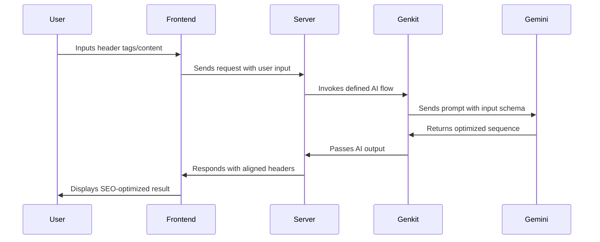

---

# 🚀 SEO Header Aligner

Welcome to the **SEO Header Aligner** — a powerful AI-driven solution designed to help developers and digital marketers fine-tune their HTML header tags for better SEO performance. Powered by **Next.js**, **Genkit**, and **Gemini**, this tool intelligently suggests optimal header sequences based on your page content.

## 🌟 Features

- ✨ AI-Powered Header Optimization using Gemini via Genkit
- 📄 Seamless integration with ShadCN UI components
- 🛠️ Schema-safe prompts with Zod for robustness
- 🧠 Smart alignment logic based on SEO best practices
- ⚡ Fast and responsive performance with Tailwind CSS

---

## 📁 Project Structure

| Directory/File           | Description |
|--------------------------|-------------|
| `src/app/`               | Main pages and server actions |
| `src/components/`        | UI and custom React components (including `seo-header-aligner.tsx`) |
| `src/ai/`                | All Genkit logic |
| ├── `flows/`             | Core AI workflows and prompts |
| ├── `schemas/`           | Zod schemas defining input/output structures |
| └── `genkit.ts`          | Genkit configuration and plugin setup |
| `public/`                | Static assets |
| `tailwind.config.ts`     | Tailwind CSS configuration |

---

## 🔌 API Integration Flow

Here’s how the AI-powered SEO header alignment works behind the scenes:



---

## 🛠️ Technologies Used

- [Next.js](https://nextjs.org/)
- [Genkit](https://github.com/genkit-dev/genkit)
- [Gemini](https://deepmind.google/technologies/gemini/)
- [ShadCN UI](https://ui.shadcn.dev/)
- [Zod](https://zod.dev/)
- [Tailwind CSS](https://tailwindcss.com/)

---

## 🤝 Contributing

If you'd like to contribute or suggest improvements, feel free to fork the repo and create a pull request. Every idea is welcome!

## 📄 License

This project is licensed under the MIT License. See the [LICENSE](LICENSE) file for details.

---

Crafted with ❤️ by Md Obaidul Haque.  
Explore more: [GitHub Profile](https://github.com/md-obaidul-haque0011)
```
